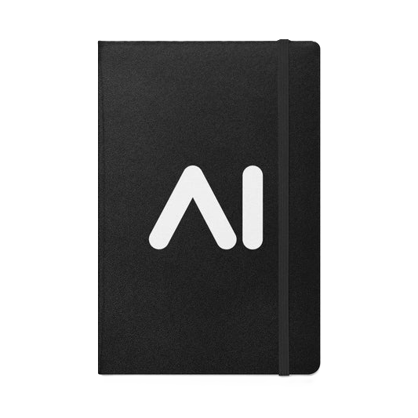

<!-- PROJECT LOGO -->
 

  

<h3 align="center">AI Voice Dictator</h3>

  

    A voice dictation app that uses an LLM to transcribe and format text in real-time
  

[![Product Name Video][product-video]][repo-url]

(<a href="#readme-top">back to top</a>)

### Built With

![Azure](https://img.shields.io/badge/azure-069AF3.svg?style=for-the-badge&logo=data%3Aimage%2Fsvg%2Bxml%3Bbase64%2CPHN2ZyB3aWR0aD0iMTUwIiBoZWlnaHQ9IjE1MCIgdmlld0JveD0iMCAwIDk2IDk2IiB4bWxucz0iaHR0cDovL3d3dy53My5vcmcvMjAwMC9zdmciPiAgICA8ZGVmcz4gICAgICAgIDxsaW5lYXJHcmFkaWVudCBpZD0iZTM5OWMxOWYtYjY4Zi00MjlkLWIxNzYtMThjMjExN2ZmNzNjIiB4MT0iLTEwMzIuMTcyIiB4Mj0iLTEwNTkuMjEzIiB5MT0iMTQ1LjMxMiIgeTI9IjY1LjQyNiIgZ3JhZGllbnRUcmFuc2Zvcm09Im1hdHJpeCgxIDAgMCAtMSAxMDc1IDE1OCkiIGdyYWRpZW50VW5pdHM9InVzZXJTcGFjZU9uVXNlIj4gICAgICAgICAgICA8c3RvcCBvZmZzZXQ9IjAiIHN0b3AtY29sb3I9IiMxMTRhOGIiLz4gICAgICAgICAgICA8c3RvcCBvZmZzZXQ9IjEiIHN0b3AtY29sb3I9IiMwNjY5YmMiLz4gICAgICAgIDwvbGluZWFyR3JhZGllbnQ+ICAgICAgICA8bGluZWFyR3JhZGllbnQgaWQ9ImFjMmE2ZmMyLWNhNDgtNDMyNy05YTNjLWQ0ZGNjMzI1NmUxNSIgeDE9Ii0xMDIzLjcyNSIgeDI9Ii0xMDI5Ljk4IiB5MT0iMTA4LjA4MyIgeTI9IjEwNS45NjgiIGdyYWRpZW50VHJhbnNmb3JtPSJtYXRyaXgoMSAwIDAgLTEgMTA3NSAxNTgpIiBncmFkaWVudFVuaXRzPSJ1c2VyU3BhY2VPblVzZSI+ICAgICAgICAgICAgPHN0b3Agb2Zmc2V0PSIwIiBzdG9wLW9wYWNpdHk9Ii4zIi8+ICAgICAgICAgICAgPHN0b3Agb2Zmc2V0PSIuMDcxIiBzdG9wLW9wYWNpdHk9Ii4yIi8+ICAgICAgICAgICAgPHN0b3Agb2Zmc2V0PSIuMzIxIiBzdG9wLW9wYWNpdHk9Ii4xIi8+ICAgICAgICAgICAgPHN0b3Agb2Zmc2V0PSIuNjIzIiBzdG9wLW9wYWNpdHk9Ii4wNSIvPiAgICAgICAgICAgIDxzdG9wIG9mZnNldD0iMSIgc3RvcC1vcGFjaXR5PSIwIi8+ICAgICAgICA8L2xpbmVhckdyYWRpZW50PiAgICAgICAgPGxpbmVhckdyYWRpZW50IGlkPSJhN2ZlZTk3MC1hNzg0LTRiYjEtYWY4ZC02M2QxOGU1ZjdkYjkiIHgxPSItMTAyNy4xNjUiIHgyPSItOTk3LjQ4MiIgeTE9IjE0Ny42NDIiIHkyPSI2OC41NjEiIGdyYWRpZW50VHJhbnNmb3JtPSJtYXRyaXgoMSAwIDAgLTEgMTA3NSAxNTgpIiBncmFkaWVudFVuaXRzPSJ1c2VyU3BhY2VPblVzZSI+ICAgICAgICAgICAgPHN0b3Agb2Zmc2V0PSIwIiBzdG9wLWNvbG9yPSIjM2NjYmY0Ii8+ICAgICAgICAgICAgPHN0b3Agb2Zmc2V0PSIxIiBzdG9wLWNvbG9yPSIjMjg5MmRmIi8+ICAgICAgICA8L2xpbmVhckdyYWRpZW50PiAgICA8L2RlZnM+ICAgIDxwYXRoIGZpbGw9InVybCgjZTM5OWMxOWYtYjY4Zi00MjlkLWIxNzYtMThjMjExN2ZmNzNjKSIgZD0iTTMzLjMzOCA2LjU0NGgyNi4wMzhsLTI3LjAzIDgwLjA4N2E0LjE1MiA0LjE1MiAwIDAgMS0zLjkzMyAyLjgyNEg4LjE0OWE0LjE0NSA0LjE0NSAwIDAgMS0zLjkyOC01LjQ3TDI5LjQwNCA5LjM2OGE0LjE1MiA0LjE1MiAwIDAgMSAzLjkzNC0yLjgyNXoiLz4gICAgPHBhdGggZmlsbD0iIzAwNzhkNCIgZD0iTTcxLjE3NSA2MC4yNjFoLTQxLjI5YTEuOTExIDEuOTExIDAgMCAwLTEuMzA1IDMuMzA5bDI2LjUzMiAyNC43NjRhNC4xNzEgNC4xNzEgMCAwIDAgMi44NDYgMS4xMjFoMjMuMzh6Ii8+ICAgIDxwYXRoIGZpbGw9InVybCgjYWMyYTZmYzItY2E0OC00MzI3LTlhM2MtZDRkY2MzMjU2ZTE1KSIgZD0iTTMzLjMzOCA2LjU0NGE0LjExOCA0LjExOCAwIDAgMC0zLjk0MyAyLjg3OUw0LjI1MiA4My45MTdhNC4xNCA0LjE0IDAgMCAwIDMuOTA4IDUuNTM4aDIwLjc4N2E0LjQ0MyA0LjQ0MyAwIDAgMCAzLjQxLTIuOWw1LjAxNC0xNC43NzcgMTcuOTEgMTYuNzA1YTQuMjM3IDQuMjM3IDAgMCAwIDIuNjY2Ljk3Mkg4MS4yNEw3MS4wMjQgNjAuMjYxbC0yOS43ODEuMDA3TDU5LjQ3IDYuNTQ0eiIvPiAgICA8cGF0aCBmaWxsPSJ1cmwoI2E3ZmVlOTcwLWE3ODQtNGJiMS1hZjhkLTYzZDE4ZTVmN2RiOSkiIGQ9Ik02Ni41OTUgOS4zNjRhNC4xNDUgNC4xNDUgMCAwIDAtMy45MjgtMi44MkgzMy42NDhhNC4xNDYgNC4xNDYgMCAwIDEgMy45MjggMi44MmwyNS4xODQgNzQuNjJhNC4xNDYgNC4xNDYgMCAwIDEtMy45MjggNS40NzJoMjkuMDJhNC4xNDYgNC4xNDYgMCAwIDAgMy45MjctNS40NzJ6Ii8+PC9zdmc+)

(<a href="#readme-top">back to top</a>)

<!-- CONTRIBUTING -->
## Contributing

If you have a suggestion that would make this better, please fork the repo and create a pull request. You can also simply open an issue with the tag "enhancement".
Don't forget to give the project a star! Thanks again!

1. Fork the Project
2. Create your Feature Branch (`git checkout -b feature/AmazingFeature`)
3. Commit your Changes (`git commit -m 'Add some AmazingFeature'`)
4. Push to the Branch (`git push origin feature/AmazingFeature`)
5. Open a Pull Request

(<a href="#readme-top">back to top</a>)

## Acknowledgements

 - Thanks to [Coding with Lewis](https://youtube.com/@codingwithlewis?si=qhaNvxxXAs77CWA1) for the inspiration

[product-video]: assets/showcase.gif

<!-- Product images and URLs -->
[repo-url]: https://github.com/layth49/VerbalMemory-HB

[verbalMemory-hb]: https://humanbenchmark.com/tests/verbal-memory
